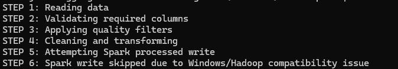
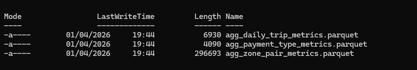

# 🚕 End-to-End Spark ETL Pipeline for NYC Taxi Trip Analytics

## 📌 Overview

This project demonstrates the design and implementation of a **production-style ETL pipeline** using real-world NYC Taxi data.

The pipeline ingests raw trip records, applies data validation and transformation using PySpark, and generates analytics-ready datasets for business reporting.

It reflects how data engineers structure pipelines in real environments, including modular design, data quality checks, and layered outputs.

---

## 🎯 Business Problem

Raw mobility datasets are not directly usable for analysis.
Organizations need pipelines that:

* clean and validate large datasets
* remove inconsistent or unrealistic records
* generate reliable business metrics

This project simulates how data engineers prepare **analytics-ready datasets** for reporting and decision-making.

---

## 📊 Dataset

NYC Taxi & Limousine Commission (TLC) — Yellow Taxi Trip Records

Key fields used:

* pickup & dropoff timestamps
* passenger count
* trip distance
* pickup & dropoff location IDs
* payment type
* fare, tip, and total amounts

### 📥 Dataset Access

The dataset is too large to be included in this repository.

You can download it from the official source:

👉 https://www.nyc.gov/site/tlc/about/tlc-trip-record-data.page

After downloading, place the file here:

```text
data/raw/yellow_tripdata_2026-01.parquet
```

---

## 🧰 Tech Stack

* **Python** — core programming language
* **PySpark** — distributed data processing and transformation
* **Pandas** — curated analytics layer and aggregations
* **PostgreSQL (Docker)** — optional data storage layer
* **SQLAlchemy & pg8000** — database connectivity

---

## 🏗️ Project Structure

```text
spark-nyc-taxi-etl/
├── config/
│   └── config.yaml
├── data/
│   ├── raw/
│   ├── processed/
│   └── curated/
├── docs/
├── sql/
│   ├── create_tables.sql
│   └── analytics_queries.sql
├── src/
│   ├── extract.py
│   ├── validate.py
│   ├── transform.py
│   ├── load.py
│   ├── main.py
│   └── curated_layer.py
├── tests/
├── docker-compose.yml
├── requirements.txt
├── README.md
```

---

## ⚙️ Pipeline Architecture

### 🔹 Stage 1: Spark Transformation Pipeline

Implemented in `src/main.py`:

* read raw parquet dataset
* validate required columns
* apply data quality filters
* perform transformations and feature engineering

Due to Windows Hadoop limitations, PySpark is used for transformation logic while pandas ensures reliable output generation.

---

### 🔹 Stage 2: Curated Analytics Layer

Implemented in `src/curated_layer.py`:

* generate aggregated datasets
* produce analytics-ready outputs

---

## 🧹 Data Quality Rules

The pipeline enforces:

* valid pickup & dropoff timestamps
* trip distance > 0
* non-negative fare and total amounts
* passenger count between 1 and 6
* trip duration between 1 and 300 minutes
* realistic speed ranges

---

## 📊 Results

The pipeline generates analytics-ready datasets including:

* daily trip metrics (trip volume, revenue, distance)
* payment method distribution analysis
* zone-to-zone trip performance insights

These outputs can be directly used for reporting, dashboards, or business analysis.

---

## 📈 Outputs Generated

### Processed Layer

* cleaned trip-level dataset

### Curated Layer

* `agg_daily_trip_metrics.parquet`
* `agg_payment_type_metrics.parquet`
* `agg_zone_pair_metrics.parquet`

---

## 🚀 How to Run the Project

Follow these steps to reproduce the pipeline locally.

### 1️⃣ Clone repository

```bash
git clone https://github.com/fredgy-data/spark-nyc-taxi-etl.git
cd spark-nyc-taxi-etl
```

---

### 2️⃣ Install dependencies

```bash
pip install -r requirements.txt
```

---

### 3️⃣ Add dataset

```text
data/raw/yellow_tripdata_2026-01.parquet
```

---

### 4️⃣ Run Spark pipeline

```bash
python src/main.py
```

---

### 5️⃣ Run curated pipeline

```bash
python src/curated_layer.py
```

---

### 6️⃣ Verify outputs

```bash
dir data\curated
```

---

## 📸 Screenshots

### Project Structure


### Spark Pipeline Run



### Curated Pipeline Run


### Curated Outputs



---

## 🗄️ Database Layer (Optional)

PostgreSQL integration is included via Docker:

```bash
docker compose up -d
```

The database load step is optional and may depend on local environment configuration.

---

## ⚠️ Local Environment Notes

* Spark write operations may fail on Windows due to Hadoop (`winutils`) limitations
* Pandas ensures reliable local output generation
* PostgreSQL loading may require additional configuration

---

## 🔮 Future Improvements

* run the full pipeline in Linux or WSL
* add Apache Airflow orchestration
* implement streaming pipeline using Kafka
* build dashboards (Power BI / Tableau)

---

## 💡 Key Learnings

* designing modular ETL pipelines using real datasets
* applying data quality validation in transformation workflows
* combining distributed processing (PySpark) with local analytics layers
* structuring projects for reproducibility and scalability


---

## ⭐ Key Takeaway

This project demonstrates how real-world raw data is transformed into **analytics-ready datasets**, reflecting real-world data engineering practices used in production environments.

